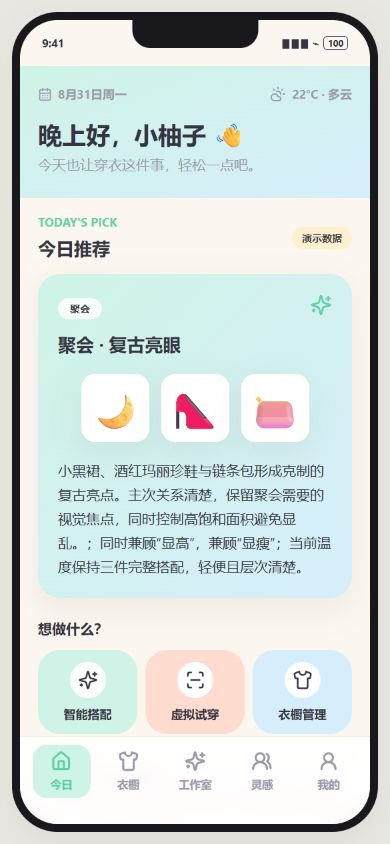
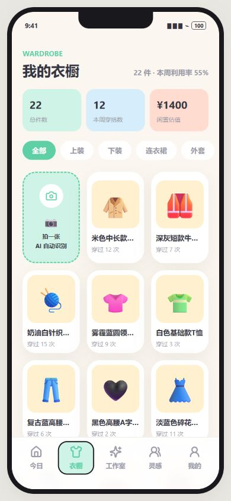
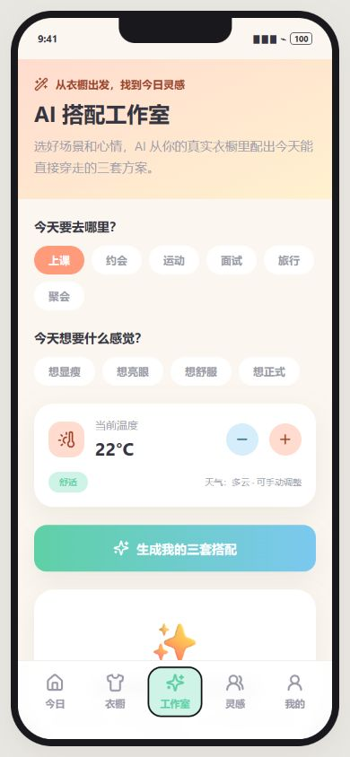
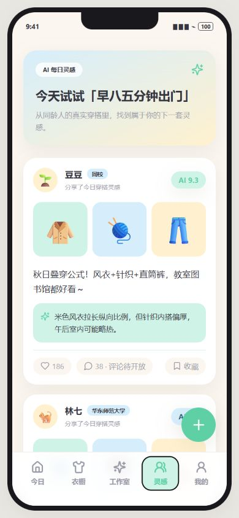
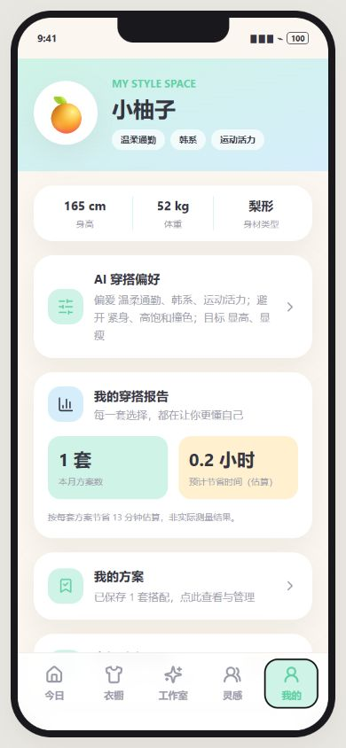
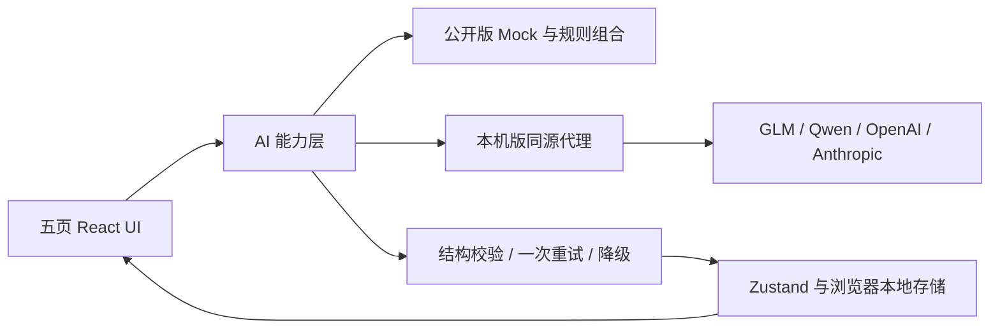

# 衣搭 AI · 校园穿搭助手

**从已有衣橱出发的 AI 产品原型。** 面向校园多场景，连接衣物录入、场景搭配、穿搭点评与方案管理。

[在线体验](https://wuyue6756-oss.github.io/yida-ai/demo/#/studio) · [项目介绍](https://wuyue6756-oss.github.io/yida-ai/) · [验证记录与边界](docs/verification.md)


## 招聘者 60 秒体验

1. 工作室选择“面试”、22°C → 生成三套演示搭配。
2. 改为 15°C，观察外套与完整性约束；保存一套。
3. “我的” → “我的方案”，查看保存结果。
4. 衣橱体验图片选择、标签修正与入库。

## 产品问题与范围

目标假设：大学生在上课、面试、运动等场景切换时，需要从已有衣服中更快做出搭配决定。先验证已有衣橱的组合与使用。关于决策耗时、闲置率和用户收益的假设尚待访谈与实测。

| 模块 | 已实现体验 |
|---|---|
| 首页 | 今日演示推荐、日期缓存、衣橱洞察 |
| 衣橱 | 22 件预置单品、7 类筛选、图片录入、识别确认、编辑与使用记录 |
| 搭配工作室 | 6 场景、心情、温度、三套完整方案、换批与保存 |
| 灵感社区 | Seed 信息流、组合点评|
| 我的 | 偏好管理、方案查看与删除、本地数据重置 |

## 关键产品取舍

- **人工确认入库**：识别可能出错，用户可先修正标签再写入衣橱。
- **硬规则与语义质量分开**：完整上下身、鞋与温度外套规则可校验，审美与身材适配不能只靠 Schema 保证。
- **可解释的失败处理**：JSON 解析、字段校验、携带原因重试一次，失败后明确降级。来源标签区分真实 AI、Mock 与配置服务。
- **方案闭环**：生成 → 保存 → 查看 → 删除，展示输出卡片。
- **安全的招聘演示**：公开构建强制 Mock，不读取 .env、不提供 AI 网关；数据仅留在当前浏览器。

## 真实 AI 验证

| 能力 | 2026-08-31 结果 |
|---|---|
| 白色 V 领短袖识别 | 单张公开样本通过，2046ms |
| 完整三件组合点评 | 定向通过，5822ms |
| 缺鞋组合点评 | 校验重试后通过，9820ms |
| 面试 22°C 三套搭配 | 15 秒超时后降级，未通过；15°C / 30°C 未执行 |

上述是定向用例。[查看原始记录](docs/evidence/README.md)。既有 175 项工程回归与随后 8 项增量回归有记录。

## 界面预览

390×844 浏览器视口；Seed / Mock 数据。

    

## 架构与技术



React 18、TypeScript、Vite、Tailwind CSS、Zustand、React Router。四家 provider 调用路径已实现。Key 仅由本机 Node 代理读取，公开版没有服务端。

## 本地运行

Node.js 22+：

```bash
npm ci
npm run build
npm start
```

```bash
# 公开构建，不读取本机 .env
npm run build:demo
# 完整离线工程回归，不调用真实模型
npm test
# 缺陷定向回归
node docs/tests/phase6b.mjs
```

静态文件位于 `docs/`，Hash 路由支持 GitHub Pages 子路径及刷新。本机版本保留 BrowserRouter 和代理。真实 AI 网关公开前还需鉴权、配额、预算和滥用防护。

## 目录

`src/pages` 五页界面 · `src/ai` 提示词、规则与解析 · `src/store` 持久化 · `docs/evidence` 原始通过/失败记录 · `docs/tests` 离线回归 · `docs/scripts` 构建及本机代理 · `docs/demo` 公开构建 · `docs/portfolio` 简历材料。

## 限制与下一步

真实搭配的超时和输出质量、多样衣物识别、手机硬件兼容与用户访谈仍待补齐。天气、社区热度、估值与节省时间均是演示或估算；虚拟试穿、真实社交、账号同步和离线服务未实现。


